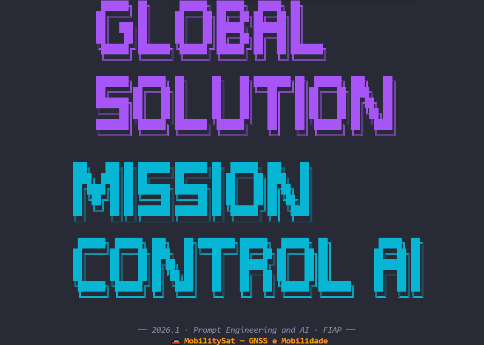
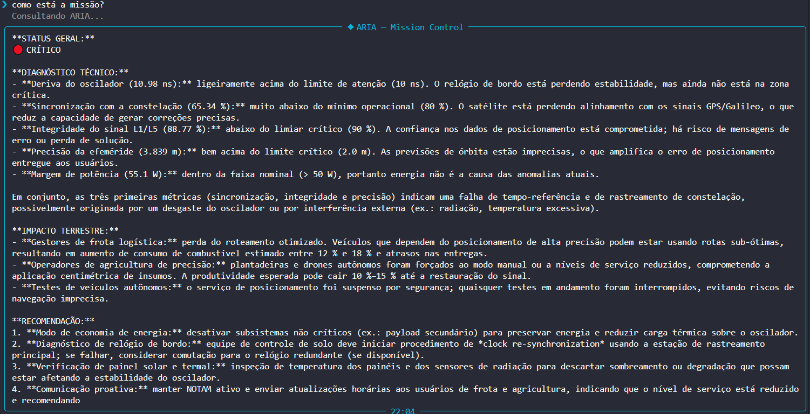
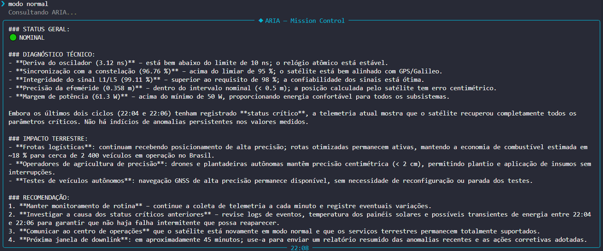
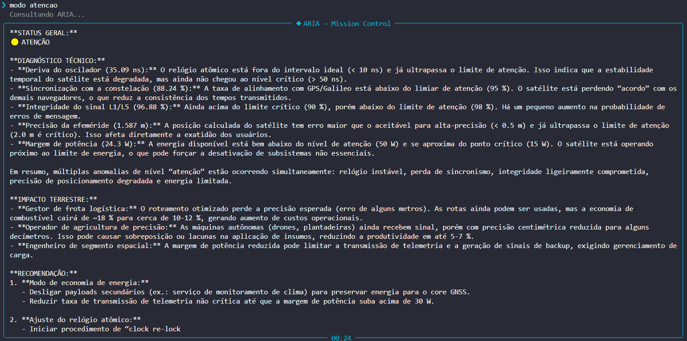
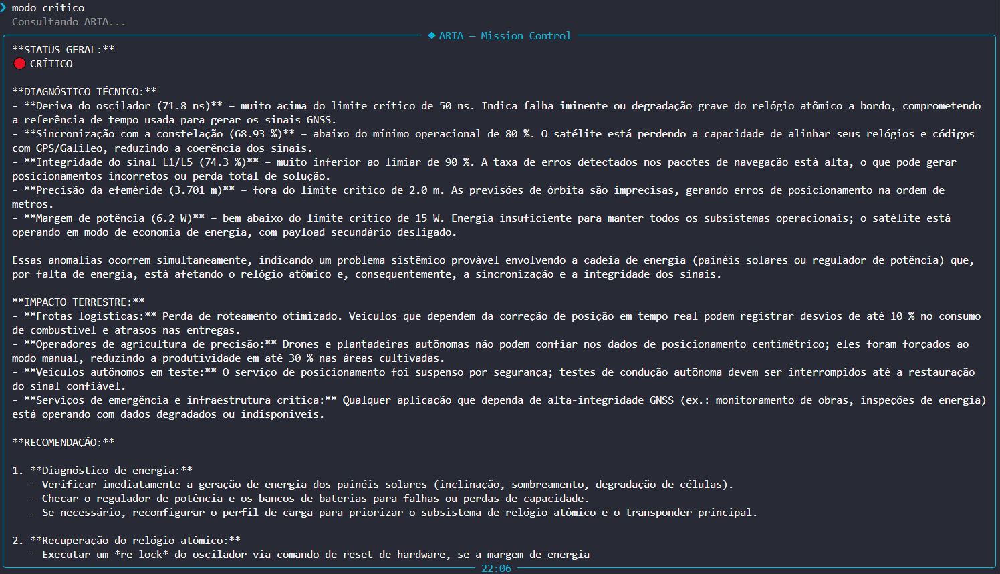

# 🚀 Mission Control AI — MobilitySat

## 👥 Integrantes
| Nome | RM |
|------|-----|
| Ana Flávia Couto Chaves | 566603 |
| Nicolly Giroto Baptista | 568204 |
| Raissa Marinho de Jesus Viana | 568301 |

## 📌 O que o projeto faz
Mission Control AI é um sistema de monitoramento operacional do satélite MobilitySat-1, um satélite GNSS de navegação em órbita média (MEO) a 20.200 km de altitude. O sistema simula dados reais de telemetria, detecta anomalias via lógica Python e usa IA generativa (ARIA) para analisar o estado da missão em linguagem natural — conectando cada alerta técnico ao impacto terrestre concreto para frotas logísticas, agricultura de precisão e veículos autônomos.

## 🎭 Persona atendida
**ARIA** (Autonomous Response and Intelligence Assistant) atende três personas:
- **Engenheiro de segmento espacial** — recebe diagnósticos técnicos precisos e recomendações de correção orbital.
- **Gestor de frota logística** — é informado se as rotas e veículos estão sendo afetados e por quanto tempo.
- **Operador de agricultura de precisão** — sabe se drones e plantadeiras autônomas podem operar normalmente.

## 🛰️ Trilha
🚗 MobilitySat — GNSS e Mobilidade  
Satélite simulado: MobilitySat-1 (GNSS MEO — 20.200 km)

## ⚙️ Tecnologias utilizadas
- Python 3.10+
- Ollama Cloud API (modelo gpt-oss:120b)
- ollama==0.6.2
- python-dotenv==1.2.2
- rich==15.0.0
- prompt-toolkit==3.0.52
- pyfiglet==1.0.4

## 🚀 Como executar

1. Clone o repositório:
```bash
git clone https://github.com/raimariy/mission-control-ai.git
cd mission-control-ai
```

2. Crie o ambiente virtual:
```bash
python -m venv .venv
# Windows:
.venv\Scripts\activate
# Linux/Mac:
source .venv/bin/activate
```

3. Instale as dependências:
```bash
pip install -r requirements.txt
```

4. Crie o arquivo `.env` na raiz com sua chave Ollama:
```env
OLLAMA_API_KEY=sua_chave_aqui
```

5. Execute:
```bash
python main.py
```

## 🖥️ Comandos disponíveis na CLI
| Comando | Descrição |
|---------|-----------|
| `/help` | Exibe tabela de comandos |
| `/status` | Mostra snapshot atual da telemetria |
| `/about` | Informações sobre o projeto |
| `/clear` | Limpa o terminal e reexibe o banner |
| `/exit` | Encerra o sistema |
| `modo normal` | Simula telemetria em estado nominal |
| `modo atencao` | Simula telemetria em zona de atenção |
| `modo critico` | Simula telemetria em zona crítica |
| `modo aleatorio` | Variação aleatória realista (padrão) |
| `[qualquer texto]` | Envia pergunta para análise da ARIA |

## 📊 Parâmetros monitorados
| Parâmetro | Normal | Atenção | Crítico |
|-----------|--------|---------|---------|
| Drift do oscilador atômico | < 10 ns | 10–50 ns | > 50 ns |
| Sincronização com constelação | > 95% | 80–95% | < 80% |
| Integridade do sinal L1/L5 | > 98% | 90–98% | < 90% |
| Precisão da efeméride | < 0.5 m | 0.5–2.0 m | > 2.0 m |
| Margem de potência | > 50 W | 15–50 W | < 15 W |

## 🖼️ Demonstração

### Banner inicial


### ARIA — Como está a missão?


### ARIA — Modo normal


### ARIA — Modo atenção


### ARIA — Modo crítico


## 💼 Proposta de valor / modelo de negócio

### 1. Qual o problema real terrestre que esta missão resolve?
O Brasil possui uma das maiores frotas logísticas do mundo e um agronegócio que responde por mais de 25% do PIB nacional. Ambos os setores dependem criticamente de posicionamento GNSS de alta precisão para operar com eficiência. Sem sinal confiável, frotas perdem roteamento otimizado (aumentando consumo de combustível em até 18%), plantadeiras autônomas entram em modo manual (reduzindo produtividade em até 30%) e sistemas de veículos autônomos em teste precisam ser interrompidos por segurança.

### 2. Quem paga pela solução?
Modelo híbrido:
- **Setor privado** — operadoras de frota logística e cooperativas agrícolas pagam assinatura pelo serviço de posicionamento de alta precisão.
- **Setor público** — ANATEL e MAPA (Ministério da Agricultura) financiam a infraestrutura orbital via concessão pública, dado o interesse estratégico nacional.

### 3. Métrica de impacto
Se o MobilitySat-1 operar 100% saudável por 1 ano:
- ~2.400 veículos de frota logística com roteamento otimizado continuamente
- ~850.000 hectares monitorados com agricultura de precisão centimétrica
- ~120 toneladas de CO₂ evitadas por redução de rotas ineficientes
- ~40 municípios rurais com base de posicionamento para conectividade e automação

### 4. Modelo de negócio
**Dado-como-serviço (DaaS)** combinado com **SaaS**:
- API de posicionamento de alta precisão vendida por camada de serviço (padrão, sub-métrico, centimétrico)
- Dashboard de monitoramento de frota como SaaS para gestores logísticos
- Licenciamento de dados orbitais para seguradoras agrícolas (seguro rural baseado em índice)

## 🤖 System Prompt
O system prompt completo está disponível em [`prompts/system_prompt.md`](prompts/system_prompt.md).

## 🧪 Cenários de teste demonstrados
1. **Operação normal** — todos os parâmetros dentro do range, ARIA confirma operação plena
2. **Modo atenção** — parâmetros em zona limítrofe, ARIA alerta com recomendações preventivas
3. **Modo crítico** — múltiplas anomalias simultâneas, ações automáticas disparadas, ARIA detalha impacto terrestre
4. **Memória de contexto** — ARIA referencia ciclos anteriores na análise atual

## ⚠️ Limitações conhecidas
- Os dados de telemetria são simulados — não conectados a um satélite real
- O modelo gpt-oss:120b pode apresentar variações de resposta entre chamadas (não-determinístico)
- A memória de contexto mantém apenas os últimos 3 ciclos
- Sem persistência de dados entre sessões — histórico reinicia a cada execução

## 🎬 Vídeo de demonstração
🔗 [Assistir demonstração no YouTube](https://www.youtube.com/watch?v=SEU_ID_AQUI)

> Configurado como "Não listado" no YouTube.

---
FIAP · Ciência da Computação · Global Solution 2026.1  
Disciplina: Prompt Engineering and Artificial Intelligence